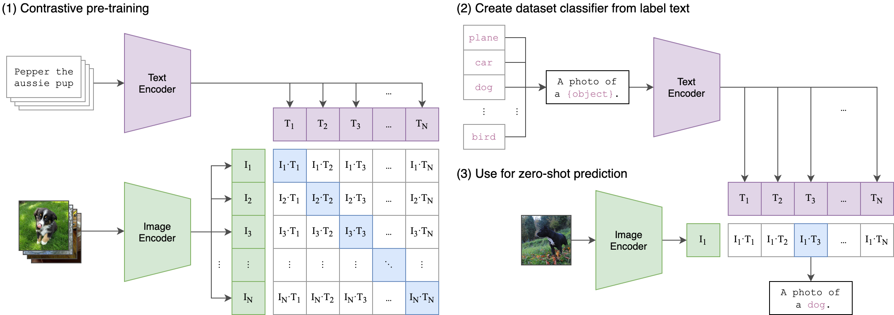
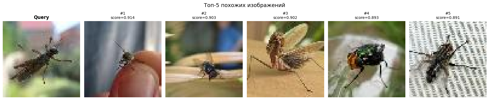
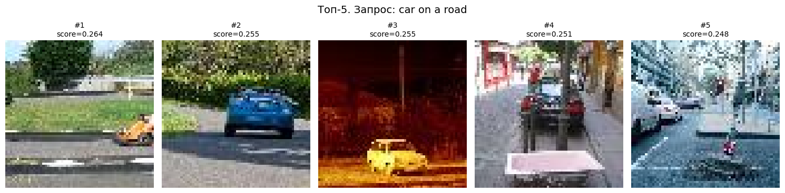

# Image Retrieval с CLIP и FAISS

Система поиска изображений на основе семантических эмбеддингов. Позволяет искать похожие изображения как по изображению, так и по текстовому описанию.

Изображения из [Tiny ImageNet-200](http://cs231n.stanford.edu/tiny-imagenet-200.zip).



## Описание

```
Запрос (текст или изображение)
        ↓
   CLIP-энкодер → вектор 512-dim (L2-нормализованный)
        ↓
   FAISS IndexFlatIP.search(query_vec, k=5)
        ↓
   Топ-k изображений по косинусному сходству
```

CLIP обучен на парах (изображение, текст), поэтому текстовые и визуальные эмбеддинги находятся в одном пространстве — это позволяет напрямую сравнивать текстовый запрос с изображениями.

Проект реализует два режима поиска:

- **Image-to-Image**
- **Text-to-Image**

Оба режима работают через единый векторный индекс FAISS, построенный на эмбеддингах CLIP.

### Пример: поиск по изображению



### Пример: поиск по тексту `"car on a road"`



## Стек

| Компонент | Инструмент |
|---|---|
| Модель эмбеддингов | `openai/clip-vit-base-patch32`|
| Векторный индекс | FAISS (IndexFlatIP, т.к. векторов всего 10000) |
| Метрика сходства | Косинусное сходство (на L2-нормализованных векторах) |
| Датасет | Tiny ImageNet-200 (10 000 тестовых изображений, 64×64 px) |

## Структура репозитория

```
Image_Retrieval/
├── main.ipynb              # Основной ноутбук: построение индекса и поиск
├── clip_image_index.faiss  # Сохранённый FAISS-индекс (10 000 векторов, dim=512)
├── data/                   # Изображения из Tiny ImageNet-200 test split
│   ├── test_0.JPEG
│   └── ...                 # 10 000 изображений
└── assets/                 # Примеры изображений из ноутбука
    ├── query_image.JPEG    # Изображение-запрос (image-to-image поиск)
    ├── bug.png             # Топ-5 поиск по изображению
    └── car_on_a_road.png   # Топ-5 по текстовому поиску
```

## Использование

```bash
pip install faiss-cpu transformers torch pillow numpy scikit-learn matplotlib
```

Открыть и запустить `main.ipynb`. Ноутбук:
1. Загружает CLIP-модель (`openai/clip-vit-base-patch32`)
2. Кодирует все 10 000 изображений из `data/` в 512-мерные векторы
3. Строит FAISS-индекс и сохраняет его в `clip_image_index.faiss`
4. Демонстрирует поиск по изображению и по тексту  
